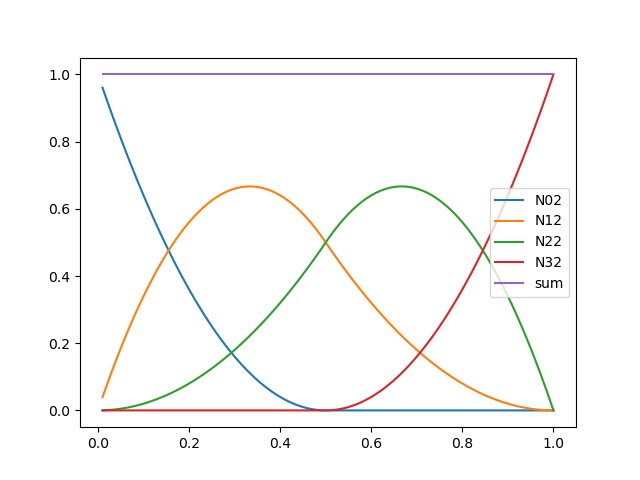

# Q03.05

## Question

Let $\mathbf{C}(u)=\sum_{i=0}^3 N_{i,2}(u)\mathbf{P}_i$, where $U=\{0,0,0,1/2,1,1,1\}$ and $\mathbf{P}_0=(-1,0)$, $\mathbf{P}_1=(-1,1)$, $\mathbf{P}_2=(1,1)$, $\mathbf{P}_3=(1,0)$. Sketch $\mathbf{C}(u)$. Compute $\mathbf{C}'(u)$, i.e. its control points and knot vector. Sketch $\mathbf{C}'(u)$.


## Solution

First we list all relevant B-spline basis functions $N_{i,p}(u)$. These functions are computed by the attached python code.

|  | $N_{0,p}$ | $N_{1,p}$ | $N_{2,p}$ | $N_{3,p}$ | 
|--|--|--|--|--|
| $p=0$ | $0$ | $0$ | $N_{2,0}(u)$ | $N_{3,0}(u)$ |
| $p=1$ | $0$ | $-(2u-1)N_{2,0}(u)$ | $2u N_{2,0}(u)$<br>$-2(u-1)N_{3,0}(u)$ | $(2u-1)N_{3,0}(u)$ | 
| $p=2$ | $(2u-1)^2 N_{2,0}(u)$ | $-2u(3u - 2) N_{2,0}(u)$ <br> $+ 2(u-1)^2 N_{3,0}(u)$ | $2u^2 N_{2,0}(u)$ <br> $-2(3u^2 - 4u + 1) N_{3,0}(u)$ |  $(2u-1)^2 N_{3,0}(u)$ | 

The 2D curve $\mathbf{C}(u)$ is a linear combination of the control points $\mathbf{P}_i$ with coefficients $N_{i,2}(u)$ ($i=0,1,2,3$). The plot below provides us insights on these functions. The plot also verifies that the sum of the four functions is 1.



To sketch the 2D curve $\mathbf{C}(u)$, we first observe that the four control points form a rectangle. The curve should be bounded within. Then we notice that the special points on the curve at $u=0,1/2,1$ can be easily computed:

$\mathbf{C}(0) = \mathbf{P}_0$

$\mathbf{C}(1/2) = (\mathbf{P}_1+\mathbf{P}_2)/2$

$\mathbf{C}(1) = \mathbf{P}_3$

These special points help us to determine the initial, middle and ending point of the curve. Since $N_{1,2}(u)>0$ and $N_{2,2}(u)>0$ for $u \in (0,1)$, we know that the curve does not pass through control point $\mathbf{P}_1$ and $\mathbf{P}_2$.

(working in progress...)

## Code

```python
from sympy import  symbols, Integer, Rational, simplify, collect, expand

def BSplineBasis(i,p,U,N0):
    if p == 0:
        if i+1 >= len(U):
            return Integer(0)
        else:
            return N0[i]
    else:
        c1 = Integer(0)
        c2 = Integer(0)
        if i+p < len(U) and U[i+p] != U[i]:
            c1 = (symbols('u') - U[i])/(U[i+p] - U[i])
        if i+p+1 < len(U) and U[i+p+1] != U[i+1]:
            c2 = (U[i+p+1] - symbols('u'))/(U[i+p+1] - U[i+1])
        return simplify(c1 * BSplineBasis(i,p-1,U,N0) 
                        + c2 * BSplineBasis(i+1,p-1,U,N0))

# Auxiliary functions
def coll(expr, N0):
    return simplify(collect(expand(expr), N0))

def build_N0(U):
    return [
        Integer(0) if U[i] == U[i+1] else symbols('N_0_'+str(i))
            for i in range(len(U)-1)] + [Integer(0)]

def non_zero_N0(N0):
    return [n for n in N0 if n != Integer(0)]

# Knots
U = [Integer(0),Integer(0),
     Integer(0),Rational(1/2),Integer(1),
     Integer(1),Integer(1)]
# Degree-0 B-splines
N0 = build_N0(U)
UN = non_zero_N0(N0)

# print basis N_ip(u)
print("p=0", [coll(BSplineBasis(i,0,U,N0), UN) for i in range(len(U)-1)])
print("p=1", [coll(BSplineBasis(i,1,U,N0), UN) for i in range(len(U)-1)])
print("p=2", [coll(BSplineBasis(i,2,U,N0), UN) for i in range(len(U)-1)])
```

The code to plot the degree-2 B-spline functions is listed below.

```python
def N02(u):
    return (2*u-1)**2 if 0 <= u < 0.5 else 0.0
def N12(u):
    return -2*u*(3*u-2) if 0 <= u < 0.5 else (2*(u-1)**2 if 0.5 <= u <= 1 else 0.0)
def N22(u):
    return 2*u**2 if 0 <= u < 0.5 else (-2*(3*u**2-4*u+1) if 0.5 <= u <= 1.0 else 0.0)
def N32(u):
    return (2*u-1)**2 if 0.5 <= u <= 1.0 else 0.0

uL = [i/100.0 for i in range(1,101)]
NL = [N02(u)+N12(u)+N22(u)+N32(u) for u in uL]

import matplotlib.pyplot as plt
plt.plot(uL, [N02(u) for u in uL], label='N02')
plt.plot(uL, [N12(u) for u in uL], label='N12')
plt.plot(uL, [N22(u) for u in uL], label='N22')
plt.plot(uL, [N32(u) for u in uL], label='N32')
plt.plot(uL, NL, label='sum')
plt.legend()
plt.savefig('BSplineBasis.png')
```

